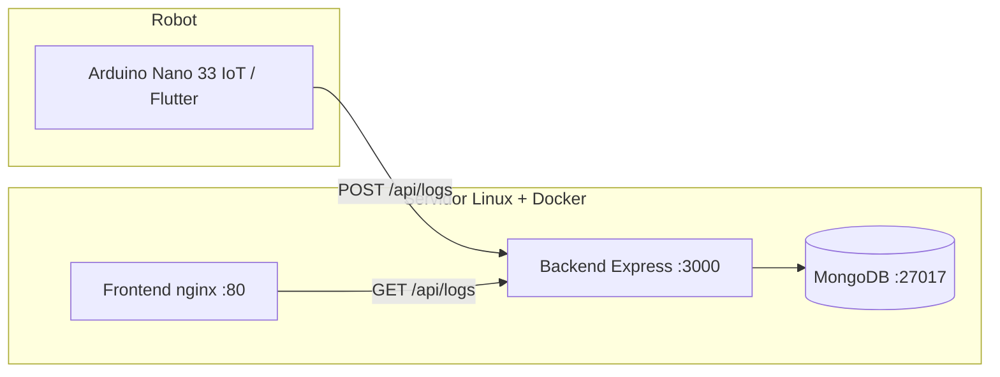

# Sistema de Monitoreo de Logs — Brazo Robótico

Proyecto final **Sistemas Operativos II** — Universidad Mariano Gálvez.

Backend Node.js/Express, MongoDB, dashboard React y orquestación Docker Compose para monitorear eventos del brazo robótico.

## Arquitectura



| Servicio  | Contenedor      | Puerto host | Red interna   |
|-----------|-----------------|-------------|---------------|
| MongoDB   | `robot-mongodb` | 27017       | `db:27017`    |
| Backend   | `robot-backend` | 3000        | `backend:3000`|
| Frontend  | `robot-frontend`| 80          | proxy `/api`  |

La URI de MongoDB **no usa localhost** dentro de Docker:

```
mongodb://<user>:<pass>@db:27017/logs?authSource=admin
```

## Tecnologías

- **Backend:** Node.js 18, Express, Mongoose, CORS
- **Base de datos:** MongoDB (imagen oficial `mongo:latest`, volumen persistente)
- **Frontend:** React 18, Vite, Tailwind CSS, nginx alpine
- **Orquestación:** Docker Compose, red `robot-net`

## Estructura del repositorio

```
prosistemas/
├── backend/          # API REST
├── frontend/         # Dashboard web
├── arduino/          # Sketch WiFi para Nano 33 IoT
├── docs/             # Guía integración Flutter
├── docker-compose.yml
├── .env.example
└── README.md
```

## API

### `POST /api/logs`

Registra un evento. El body no puede estar vacío.

```json
{
  "device_id": "brazo-robot-01",
  "event_type": "Alerta",
  "description": "Objeto detectado",
  "data_payload": { "distancia_cm": 32 }
}
```

### `GET /api/logs?limit=50`

Devuelve los últimos eventos y el total registrado.

### `GET /api/health`

Estado de la conexión a MongoDB (503 si la DB está caída).

## Despliegue en servidor Linux (DigitalOcean / VPS)

### 1. Requisitos en el servidor

```bash
sudo apt update && sudo apt install -y docker.io docker-compose-plugin git
sudo systemctl enable docker --now
```

### 2. Clonar y configurar

```bash
git clone <url-de-tu-repo>
cd prosistemas
cp .env.example .env
nano .env   # cambiar contraseñas
```

### 3. Levantar servicios

```bash
docker compose up -d --build
docker compose ps
```

### 4. Verificar

- Dashboard: `http://<IP_PUBLICA>/`
- API health: `http://<IP_PUBLICA>:3000/api/health`
- API logs: `http://<IP_PUBLICA>:3000/api/logs`

El frontend en el puerto 80 hace proxy de `/api/*` hacia el backend.

### 5. Firewall (UFW)

```bash
sudo ufw allow 22
sudo ufw allow 80
sudo ufw allow 3000
sudo ufw enable
```

## Demostración del examen

| Acción | Comando | Resultado esperado |
|--------|---------|-------------------|
| Pausar backend | `docker stop robot-backend` | POST /api/logs falla; no se guardan eventos |
| Pausar MongoDB | `docker stop robot-mongodb` | Backend responde 500/503; eventos no persisten |
| Pausar frontend | `docker stop robot-frontend` | Dashboard no accesible; backend y logs siguen |

Reanudar: `docker start <contenedor>` o `docker compose up -d`.

## Integración con tu brazo actual

Tu sketch actual (`Brazo_robotico.ino`) usa **Bluetooth**, no WiFi. Tienes dos caminos:

1. **Arduino Nano 33 IoT + WiFi:** usar `arduino/Brazo_robotico_WiFi_logs.ino` y apuntar `SERVER_HOST` a la IP del servidor.
2. **Mantener Bluetooth:** la app Flutter reenvía eventos — ver `docs/INTEGRACION_FLUTTER.md`.

### Protocolo actual (referencia)

| Comando | Función |
|---------|---------|
| `B<angulo>` | Base |
| `A<angulo>` | Brazo 1 |
| `C<angulo>` | Brazo 2 |
| `P<angulo>` | Pinza |
| `D<cm>` | Distancia (Arduino → app) |
| `OBJETO` | Alerta de proximidad |

## Variables de entorno

| Variable | Descripción |
|----------|-------------|
| `MONGO_ROOT_USER` | Usuario admin MongoDB |
| `MONGO_ROOT_PASSWORD` | Contraseña |
| `MONGO_DATABASE` | Nombre de BD (`logs`) |
| `MONGO_URI` | Generada en compose para el backend |

## IP pública del servidor

- **Dashboard:** http://157.230.187.111/
- **API:** http://157.230.187.111:3000/api/logs
- **Health:** http://157.230.187.111:3000/api/health

## Autores / Grupo

Completar con los integrantes y enlaces al historial de commits en GitHub.
